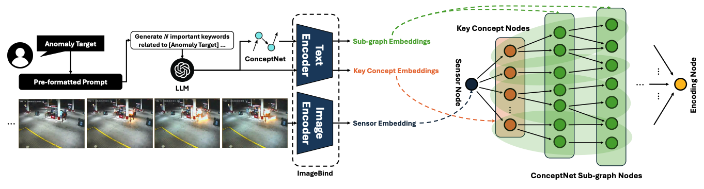
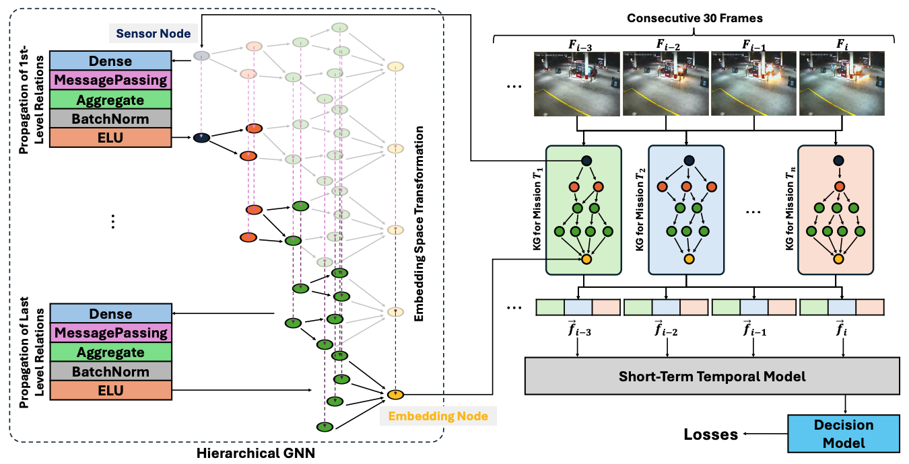

# MissionGNN – Knowledge‑Graph‑Driven Temporal Reasoning for Video Anomaly Detection

[](https://arxiv.org/abs/2406.18815)  []()

> [**MissionGNN: Hierarchical Knowledge‑Graph Reasoning Meets Short‑Term Temporal Context for Surveillance Video Anomaly Detection**](https://arxiv.org/abs/2406.18815)
> *In Proceedings of the IEEE/CVF Winter Conference on Applications of Computer Vision (WACV 2025)*
> **Hyunwoo Oh**, Sanggeon Yun, Ryozo Masukawa, Nathaniel D. Bastian, Mohsen Imani



<p align="center"><em>Figure&nbsp;1. The framework for mission-specific knowledge graph generation.</em></p>



<p align="center"><em>Figure&nbsp;2. The overall framework for our proposed model utilizing the novel concept of hierarchical graph neural network.</em></p>

MissionGNN attaches a **sensor node** (video frame embedding) to a **class‑specific knowledge graph (KG)** and propagates information through custom GCN layers.  Encodings from 13 KGs (one per UCF‑Crime event) are concatenated and passed through a lightweight transformer to yield an **(Normal + n events) classifier**.  A **decaying threshold** progressively suppresses low‑confidence positives during training, mimicking curriculum learning.

---

## 📁 Repository Structure

```
MissionGNN/
├── config.py              # Hyper‑parameters, paths
├── datasets.py            # 30‑frame sliding‑window dataset
├── graph/
│   ├── kg_loader.py       # Load & embed per‑class KGs
│   └── layers.py          # Custom GCNConvTarget
├── models/
│   ├── gcn.py             # Batched KnowledgeGCN
│   ├── temporal.py        # Transformer + prediction head
│   └── missiongnn.py      # End‑to‑end model
├── train.py               # Training loop w/ decaying τ
├── evaluate.py            # Checkpoint evaluation
├── requirements.txt       # Tested library versions
└── README.md              # You are here 🚀
```

---

## 🚀 Quickstart

### 1. Clone and install

```bash
git clone https://github.com/c0510gy/MissionGNN.git
cd MissionGNN
pip install -r requirements.txt
```

### 2. Prepare data & sub‑graphs

Place UCF‑Crime frame embeddings (`*.pt`) under
`./embeddings/` and
per‑class KG files under `./subgraphs/`:

```
subgraphs/
 ├── subgraph_Abuse.txt       # edge list: v->u per line
 ├── keywords_Abuse.txt       # key concept words (one per line)
 ├── subgraph_Arrest.txt
 └── ...
```

### 3. Train

```bash
python train.py
```

### 4. Evaluate best checkpoint

```bash
python evaluate.py
```

Outputs:

* Training / validation loss, mAUC, mAP
* Best model in `checkpoints/best.pt`

---

## 🔧 Key Configs (`config.py`)

```python
threshold_start = 1.0     # Start of decaying pseudo‑label threshold
threshold_decay = 0.9999  # Threshold decay
embed_dim       = 1024    # ImageBind huge text/video embedding size
gnn_hidden      = 8       # per‑node hidden dim inside KnowledgeGCN
```

Modify any field and re‑run `train.py`; everything else adapts automatically.

---

## 📝 Citation

```bibtex
@inproceedings{yun2025missiongnn,
  title={Missiongnn: Hierarchical multimodal gnn-based weakly supervised video anomaly recognition with mission-specific knowledge graph generation},
  author={Yun, Sanggeon and Masukawa, Ryozo and Na, Minhyoung and Imani, Mohsen},
  booktitle={2025 IEEE/CVF Winter Conference on Applications of Computer Vision (WACV)},
  pages={4736--4745},
  year={2025},
  organization={IEEE}
}
```
